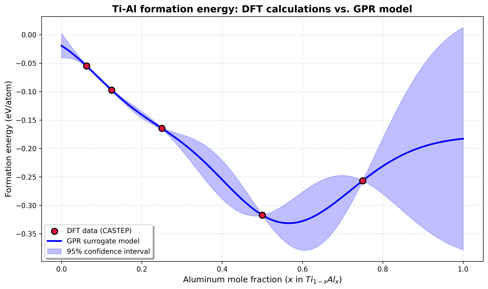

# DFT-ML Pipeline for Ti-Al Alloys

[](https://github.com/neweracy/CASTEP-ML-PIPELINE/actions/workflows/ci.yml)
[](https://www.python.org/)
[](LICENSE)
[](https://github.com/psf/black)
[](https://github.com/astral-sh/ruff)

A small, reproducible pipeline that turns **CASTEP density functional theory
(DFT)** calculations into a **machine-learning surrogate model** for the
formation energy of Ti-Al binary alloys. It parses raw CASTEP output, builds a
tidy dataset, and fits a **Gaussian Process Regression (GPR)** model that
predicts formation energy across the full composition range *with calibrated
uncertainty*.

<p align="center">
  
</p>

## Why this project

First-principles DFT calculations are accurate but expensive; a single relaxed
structure can take hours to days. This pipeline shows a practical materials-
informatics loop: compute a handful of anchor points with DFT, then use a
data-efficient model that both **interpolates** between them and **flags where
it is uncertain**, so the next expensive calculation can be spent where it
matters most.

## Results at a glance

Trained on 5 DFT-relaxed structures spanning 6.25%–75% Al:

| Metric | Value | Notes |
| --- | --- | --- |
| R² (in-sample) | 1.0000 | GPR interpolates the noise-free DFT points |
| MAE (in-sample) | 4.0e-5 eV/atom | Fit error at training points |
| **CV MAE (leave-one-out)** | **0.043 eV/atom** | Realistic generalization error |
| Mean uncertainty (σ) | 9.7e-4 eV/atom | Averaged over the composition axis |
| Optimized kernel | `1.13² × RBF(0.182)` | Learned length scale in Al-fraction units |

**Physical finding:** every calculated composition is thermodynamically stable
(negative formation energy), and Ti₈Al₈ (50% Al) is the most stable at
**−0.317 eV/atom**, consistent with the known TiAl intermetallic. See
[`docs/GRAPH_GUIDE.md`](docs/GRAPH_GUIDE.md) for a full interpretation.

## How it works

```
Materials Studio / CASTEP        data/raw/*.castep
   (scripts/, DFT stage)  ─────▶        │
                                        │  dft-parse
                                        ▼
                     data/processed/alloy_ml_dataset.csv
                                        │  dft-train
                                        ▼
         formation_energy_curve.png · gpr_model.pkl · predictions.csv
```

1. **Generate** DFT data in Materials Studio (`scripts/`, run inside the app).
2. **Parse** `.castep` files, infer composition from file names, and compute
   the formation energy per atom relative to pure-element references
   (`dft-parse`).
3. **Train** a GPR surrogate, evaluate it with leave-one-out cross-validation,
   and export the model, predictions, and figure (`dft-train`).

## Installation

Requires Python ≥ 3.9 and [uv](https://github.com/astral-sh/uv).

```bash
git clone https://github.com/neweracy/CASTEP-ML-PIPELINE.git
cd CASTEP-ML-PIPELINE

uv sync                # runtime dependencies
uv sync --extra dev    # + Jupyter, pytest, black, ruff, pre-commit
```

Installing the project exposes two console commands: `dft-parse` and `dft-train`.

## Usage

```bash
# 1. Parse CASTEP outputs in data/raw/ into the ML dataset
uv run dft-parse

# 2. Train the model, saving the figure, model, and predictions
uv run dft-train --save-model --save-predictions

# Handy options
uv run dft-train --help
uv run dft-train --n-points 500 --output outputs/hi_res_curve.png
```

Or use the Make shortcuts:

```bash
make parse   # dft-parse
make train   # dft-train --save-model --save-predictions
make check   # format + lint + test
```

## Scientific background

The **formation energy per atom** measures thermodynamic stability relative to
the pure constituents:

$$
E_\mathrm{form} = \frac{E_\mathrm{total} - (n_\mathrm{Ti}\,\mu_\mathrm{Ti} + n_\mathrm{Al}\,\mu_\mathrm{Al})}{N_\mathrm{total}}
$$

where $E_\mathrm{total}$ is the DFT total energy of the alloy cell, $\mu_i$ are
the per-atom reference energies of the pure elements, and $N_\mathrm{total}$ is
the number of atoms.

The reference energies are computed with the **same CASTEP settings** as the
alloys (PBE functional, 420 eV plane-wave cutoff, metallic treatment) and are
defined in [`src/dft_ml_pipeline/config.py`](src/dft_ml_pipeline/config.py):

| Element | Reference energy | Provenance |
| --- | --- | --- |
| Ti | −1593.839175 eV/atom | `Ti.castep`: −25501.4268 eV / 16 ions |
| Al | −110.897059 eV/atom | `Al.castep`: −3548.70602 eV / 32 ions |

> Formation energy is a small difference of large total energies, so consistent
> DFT settings between the alloy and reference calculations are essential.

## Dataset schema

`data/processed/alloy_ml_dataset.csv`:

| Column | Description |
| --- | --- |
| `Structure` | Identifier, e.g. `Ti12Al4` |
| `Total_Atoms` | Atoms in the cell |
| `n_Ti`, `n_Al` | Atom counts per element |
| `Atomic_Fraction_Al` | Al mole fraction in `[0, 1]` |
| `Total_Energy_eV` | DFT total energy (final relaxed enthalpy) |
| `Formation_Energy_eV_per_atom` | Target property |

CASTEP files must follow the `Ti{n}Al{m}.castep` convention so composition can
be inferred automatically (e.g. `Ti8Al8.castep` → 8 Ti + 8 Al).

## Project layout

```
src/dft_ml_pipeline/   Installable package (config, parsing, modeling)
tests/                 pytest suite (synthetic CASTEP fixtures)
scripts/               Materials Studio batch scripts (Python + Perl)
data/raw/              CASTEP outputs (git ignored)
data/processed/        Generated dataset (git ignored)
models/, outputs/      Trained model, figures, predictions (git ignored)
structures/            DFT input structures (*.xsd)
docs/                  Extended documentation
```

Full details in [`docs/PROJECT_STRUCTURE.md`](docs/PROJECT_STRUCTURE.md).

## Development

```bash
uv run pytest                 # run tests
uv run ruff check src/ tests/ # lint
uv run black src/ tests/      # format
uv run pre-commit install     # enable local hooks
```

Continuous integration runs lint, format checks, and tests on Python 3.9, 3.11,
and 3.12. See [`CONTRIBUTING.md`](CONTRIBUTING.md) for the full workflow.

## Documentation

- [`docs/PROJECT_STRUCTURE.md`](docs/PROJECT_STRUCTURE.md) — repository layout and data flow.
- [`docs/GRAPH_GUIDE.md`](docs/GRAPH_GUIDE.md) — how to read the formation-energy curve.
- [`docs/CLAUDE.md`](docs/CLAUDE.md) — development guidelines and conventions.
- [`docs/IMPROVEMENTS.md`](docs/IMPROVEMENTS.md) — engineering changelog.

## Roadmap

- Add DFT anchors at 18.75%, 37.5%, 62.5%, 87.5% Al to tighten interpolation.
- Include pure Ti and pure Al as end-point anchors.
- Explore richer descriptors (local environments, short-range order).
- Active learning: use GPR uncertainty to propose the next calculation.
- Convex-hull construction for ground-state phase identification.

## Citation

If you use this software, please cite it via [`CITATION.cff`](CITATION.cff):

```bibtex
@software{dft_ml_pipeline,
  title  = {DFT-ML Pipeline for Ti-Al Alloys},
  author = {neweracy},
  year   = {2026},
  url    = {https://github.com/neweracy/CASTEP-ML-PIPELINE}
}
```

## License

Released under the [MIT License](LICENSE).
